# Context-aware LLM GEO Label Extractor

[](https://github.com/SciSpectator/LLM-GEO-Label-Extractor/actions/workflows/ci.yml)
[](LICENSE)
[](pyproject.toml)
[](docs/architecture.md)
[](docs/reference-data.md)
[](Dockerfile)


*Context-aware LLM extraction and controlled-vocabulary normalization of GEO
transcriptomic sample metadata.*

An end-to-end, checkpointed pipeline for extracting **Sex, Age, Tissue,
Condition, and Treatment** from GEO sample metadata and performing
controlled-vocabulary **entity linking**, also called concept normalization, of
the three biomedical entity fields to **MeSH**, **Cellosaurus**, or auditable
local OOV concept clusters. It is *context-aware* in two concrete senses: a sample whose
own fields are silent is recovered from its enclosing **GSE series context**
(Phase 1b), and every raw string is normalized against the vocabulary
neighbourhood a controlled reference actually defines (Phase 2), never by string
match alone.

This repository is the unified implementation accompanying the manuscript
*Context-aware LLM extraction and controlled-vocabulary normalization of GEO
transcriptomic sample metadata*.

One driver runs the whole thing. A single command, or one click in the
interface, takes the samples you selected through extraction, entity linking and
final assembly, and writes the shipped five-label corpus.

## Workflow

You choose the platform, the sample scope and which metadata columns the model
reads. The pipeline then runs Phase 1, recovers what is missing in Phase 1b,
links every distinct value to a controlled vocabulary in Phase 2, merges the
platform tables, de-duplicates within each sample, and writes the corpus.

Colour marks who runs each step: **blue** = 12B FP8 extractor (reasoning off),
**purple** = e2B reasoning model (reasoning on), **green** = deterministic
Python, **amber** = retrieval/embedding, **grey** = cached evidence. For the
step-by-step detail, see [docs/architecture.md](docs/architecture.md).

[](assets/architecture.pdf)

[Open the PDF](assets/architecture.pdf) to read the diagram at full size.

1. **Phase 1, sample extraction**: an instruction-tuned local model extracts
   verbatim Tissue, Condition, Treatment and Sex spans. Age uses the separately
   configured reasoning-capable model. Missing evidence becomes `Not Specified`.
2. **Phase 1b, GSE context recovery**: unresolved Tissue/Condition/Treatment
   values are reconsidered using the GSE title, summary, design, and sibling
   labels. Explicit GSM evidence always wins.
3. **Phase 2, entity linking**: unique raw strings are resolved once through an
   ordered cascade: persistent decision cache, polarity and field guards,
   Cellosaurus identity matching, exact MeSH matching, BioLORD-2023 retrieval,
   LLM selection, SapBERT-assisted OOV consolidation, and final case folding. A
   curation review then relocates or removes labels that were clustered onto the
   wrong concept. The dictionary is then applied to every sample.
4. **Final assembly**: the per-platform tables are merged into one shipped corpus
   carrying all five final labels, and any normalized cell that repeats an
   identifier has the duplicate label relocated out. The step is deterministic
   and calls no model.

The pipeline is backend-neutral at the HTTP boundary and expects a local or
self-hosted OpenAI-compatible endpoint such as vLLM. It sends no GEO metadata to
an external service unless the operator explicitly points it at one.

The diagram is a static graph rather than a heavyweight agent-orchestration
runtime (LangGraph, Flowise, Langfuse, and similar), because this is a batch,
resumable pipeline of local model calls rather than a live multi-agent service.
The static graph is the honest picture of the connected data flow.

| Component | Model/method | Reasoning | Persistent state |
|---|---|---|---|
| Phase 1 T/C/T/Sex | Gemma 4 12B IT, FP8 weights | off | input-hash decision cache |
| Phase 1 Age | Gemma 4 e2B IT, BF16 | on | same Phase-1 cache, keyed with Age model |
| Phase 1b | Gemma 4 12B IT + GSE/sibling evidence | off by default | SQLite GSE context cache |
| Phase 2 | Gemma 4 e2B IT + MeSH/Cellosaurus/BioLORD/SapBERT | on | per-value checkpoint and final dictionary |

See [Architecture, models, reasoning, and memory](docs/architecture.md) for the
complete connected data flow and cache semantics.

## Quick start

```bash
git clone https://github.com/SciSpectator/LLM-GEO-Label-Extractor.git
cd LLM-GEO-Label-Extractor
python -m venv .venv
source .venv/bin/activate
pip install -r requirements.txt
cp .env.example .env
```

For the desktop interface:

```bash
pip install -r requirements-gui.txt
geo-label-gui
```

See [The interface](#the-interface) below for a walkthrough of the four-step
wizard.

Build the MeSH and Cellosaurus resources as described in
[docs/reference-data.md](docs/reference-data.md), start your inference server,
then run:

```bash
geo-label-extractor \
  --input data/GEOmetadb.sqlite \
  --out-dir results/run1 \
  --vocab data/reference/vocab.sqlite \
  --index data/reference/vocab_index.npz \
  --cellosaurus data/reference/cellosaurus.sqlite \
  --phase1-model google/gemma-4-12b-it \
  --age-model google/gemma-4-e2b-it \
  --phase2-model google/gemma-4-e2b-it
```

For a small development run, append `--limit 100`. Interrupted runs resume from
checkpoints. Use `--from-stage normalize` to reuse completed extraction output,
or `--from-stage assemble` to only rebuild the merged corpus. Add `--no-assemble`
to stop after normalization.

The full run writes the shipped corpus to
`<out-dir>/final_labels/LLM_labels_all_samples.csv.gz`, a per-platform mirror
under `<out-dir>/final_labels/by_GPL/`, and a `manifest.json` with sample,
platform, and demographic-coverage counts.

### Choosing which metadata columns the model reads

A platform can be chosen freely, so the columns can be too. GEO submitters put
the same fact in different columns depending on the assay and the year, and a
column that carries the interesting text on one platform is empty on another.

`--list-fields` prints what an input actually offers, marking the default set:

```bash
geo-label-extractor --input data/samples.sqlite --out-dir results/run1 --list-fields
```

`--fields` then selects them. Naming a column the input does not have is an
error rather than a silently empty field:

```bash
geo-label-extractor \
  --input data/GEOmetadb.sqlite --out-dir results/run1 \
  --fields title,source_name_ch1,characteristics_ch1,extract_protocol_ch1,data_processing
```

In the GUI the same choice is the **Metadata columns the model reads** panel on
the *Select samples* step. **Read columns from the selected database** fills it
from the file you picked.

**The default is the published five**, `title`, `source_name_ch1`,
`characteristics_ch1`, `treatment_protocol_ch1` and `description`. Omitting
`--fields` reproduces the paper's configuration exactly. A non-default selection
is logged as such at startup, because it makes a run incomparable with the
published one.

Whether the extra columns are worth reading is measurable, and on GEO RNA-seq
records the answer is mostly no. Over 17,071 samples carrying a Phase 1b label,
the share whose label text appeared **only** in a column outside the default
five was 0.46% for Tissue, 0.06% for Condition, and 0.01% for Treatment. Columns
such as `extract_protocol_ch1` do repeat the tissue, but almost never say
anything the default five do not. The option earns its place on platforms whose
records are laid out differently, not as a way to squeeze more out of these.

## The interface

The desktop app (`geo-label-gui`) is a four-step wizard over the exact same
driver the CLI uses.

Working left to right through the sidebar:

1. **Select samples**, by pasting or loading a **GSM** list, a **GPL** list (every
   matching sample is selected), or typing a request into the **AI Assistant**
   (e.g. *"Homo sapiens breast cancer, Tissue and Condition"*), which the Phase 1
   model turns into a GEOmetadb catalogue search. **Auto-detect databases** finds
   the local GEOmetadb, MeSH, index, and Cellosaurus files. **Sample scope**
   narrows by modality and organism, and **Metadata columns the model reads**
   chooses the columns themselves. See
   [Choosing which metadata columns the model reads](#choosing-which-metadata-columns-the-model-reads).
2. **Choose labels**, ticking any of Tissue, Condition, Treatment, Sex, Age.
3. **Configure and run**, setting **Stop after** to *Phase 1*, *Phase 1 + 1b*, or
   *Full pipeline* (Phase 2 auto-runs final assembly), pointing the backend at
   your inference server, and setting the three models and worker counts.
   **Preview command** shows the exact `geo-label-extractor` line before you
   commit, and **Start extraction** runs it.
4. **Results**, which streams live logs, checkpoints, and completion status. The
   run writes the same `final_labels/` corpus as the CLI.

## Docker

```bash
cp .env.example .env
docker compose build
docker compose run --rm pipeline --limit 100
```

The container connects to an inference server on the host through
`host.docker.internal`. Reference databases are read-only, and results are
written to `./results`. Model weights are intentionally not baked into the image.

## Evaluation summary

A short summary of the manuscript evaluation is given below, taken from Tables 1
to 3 of the main text. Full definitions and the per-field error analysis live in
the paper. The evaluation code, the gold standards and the frozen per-sample
outputs behind these numbers are in [published_data/](published_data/), described under
[The data package](#the-data-package).

**Phase 1, extraction.** Two separate tables, so that no row joins a corpus
count to a benchmark score. Left: how many of the 804,427 samples carry a label
after Phase 1b. Right: how accurate those labels are, each row measured only on
the benchmark whose size is given in the same row.

<table>
<tr><td valign="top">

| Field | Labels extracted | % of 804,427 |
|---|---:|---:|
| Sex | 319,745 | 39.75% |
| Age | 383,173 | 47.63% |
| Tissue | 802,359 | 99.74% |
| Condition | 647,007 | 80.43% |
| Treatment | 369,311 | 45.91% |

</td><td width="40"></td><td valign="top">

| Field | Benchmark n | Precision | Recall | F1 |
|---|---:|---:|---:|---:|
| Sex | 9,299 | 0.997 | 0.623 | 0.767 |
| Age | 5,164 | 0.987 | 0.976 | 0.982 |
| Tissue | 1,500 | 0.997 | 0.997 | 0.997 |
| Condition | 1,500 | 0.964 | 0.950 | 0.957 |
| Treatment | 1,500 | 0.976 | 0.847 | 0.907 |

</td></tr>
</table>

Sex and Age use every applicable ALE-curated record, Tissue and Condition use
1,500 CREEDS samples, and Treatment uses 1,500 GSM/GSE-adjudicated samples.

**Phase 2, database resolution** on the exact-name/synonym in-dictionary slice
(instance-weighted, with a wrong DB identifier counting as both FP and FN):

| Field | Labels with DB answer | Precision | Recall | F1 | Accuracy |
|---|---:|---:|---:|---:|---:|
| Tissue | 342,821 | 0.988 | 0.998 | 0.993 | 0.985 |
| Condition | 219,651 | 0.994 | 0.998 | 0.996 | 0.993 |
| Treatment | 23,261 | 0.988 | 0.994 | 0.991 | 0.982 |

Whole-corpus normalization collapsed 21,254 raw Tissue strings to 10,548
concepts, 21,808 Condition strings to 15,679, and 48,216 Treatment strings to
40,287. In total 26,388 labels resolved to MeSH and 6,340 Tissue labels to
Cellosaurus, with MeSH-branch violation rates of 0.00% / 0.44% / 2.07% (Tissue /
Condition / Treatment). See
[docs/evaluation-summary.md](docs/evaluation-summary.md) for the
one-page report and the reported limitations (Treatment coverage, MeSH concept
coverage, and the deliberately conservative semantic normalization).

## The data package

[`published_data/`](published_data/) holds everything the manuscript reports: the
frozen per-sample outputs for all 804,427 samples across 834 platforms, the code
that produced them, the evaluation scripts with their result tables, the gold
standards, the versioned prompts, and the MeSH and Cellosaurus references the run
used.

| Folder | Contents |
|---|---|
| `data/05_final_labels/`, `data/06_final_labels_repaired/` | the shipped corpus, one row per sample, all five labels |
| `data/04_phase2_output/final/` | the same results split per platform, one folder per GPL |
| `data/evaluation/` | one folder per supplementary table: the script, its result CSV and a README |
| `code/` | the pipeline as it was run, by stage |
| `prompts/` | every prompt, by phase, as used for the published corpus |
| `reference/` | the MeSH and Cellosaurus databases the run resolved against |
| `figures/` | the published figures and the script behind Figure S1 |

Start from [`published_data/WHERE_IS_WHAT.md`](published_data/WHERE_IS_WHAT.md),
which maps every table and figure in the paper to the file that produces it, and
states which tables are measured, which are re-tabulated from other tables, and
which were assigned by hand.

Two inputs are stored gzip-compressed because of their size,
`data/01_input_metadata/samples_804k.json.gz` and
`data/03_age_output/age_804k.json.gz`. Compression is lossless and the evaluation
scripts read them directly.

## Documentation

- [Tutorial](docs/tutorial.md)
- [Evaluation summary (short report)](docs/evaluation-summary.md)
- [Methods and theory](docs/methods.md)
- [Architecture, models, reasoning, and memory](docs/architecture.md)
- [Reference data](docs/reference-data.md)
- [Output schema](docs/output-schema.md)
- [Reproducibility and limitations](docs/reproducibility.md)
- [Hardware and scaling](docs/hardware-and-scaling.md)

## Security and privacy

No API keys, `.env` files, author filesystem paths, or private model-service
configuration are included. Keep secrets outside version control. GEO is a
public repository, but users remain responsible for the terms and governance of
their own inputs and model endpoints.

## License

Released under the [MIT License](LICENSE).
